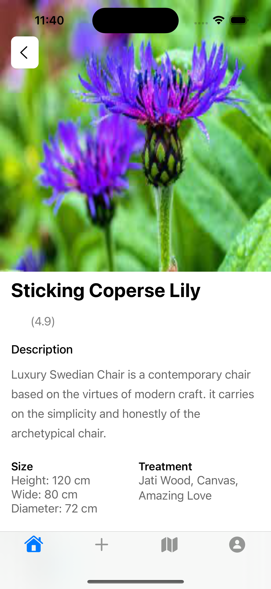
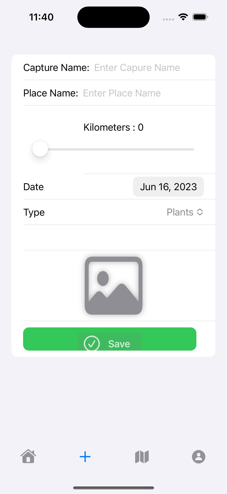
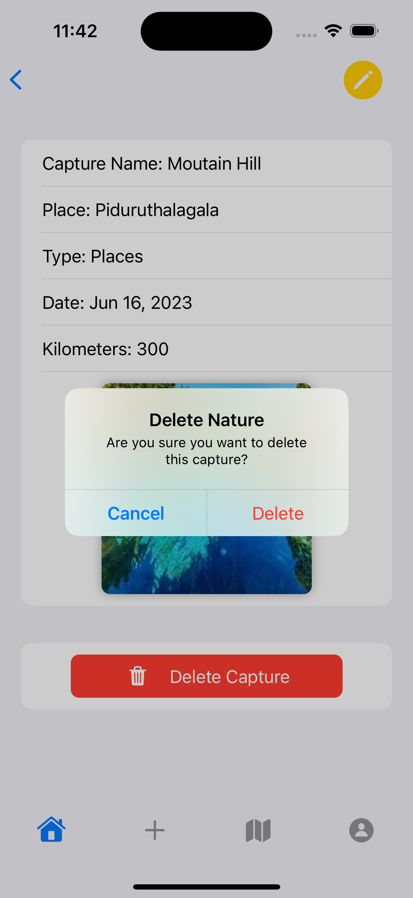
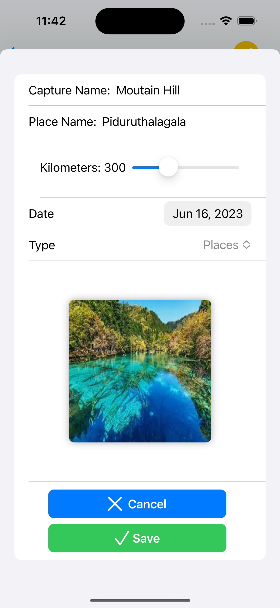
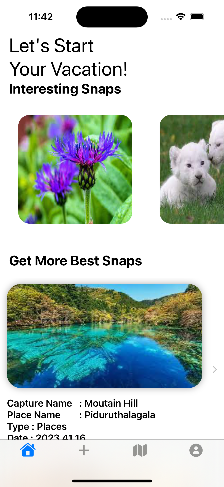
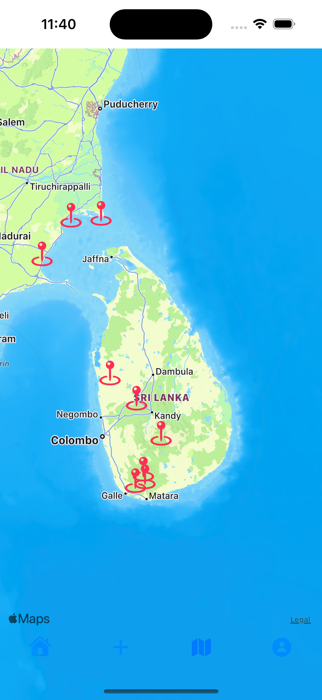
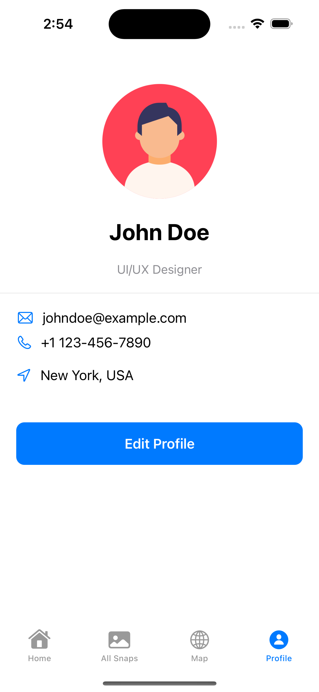
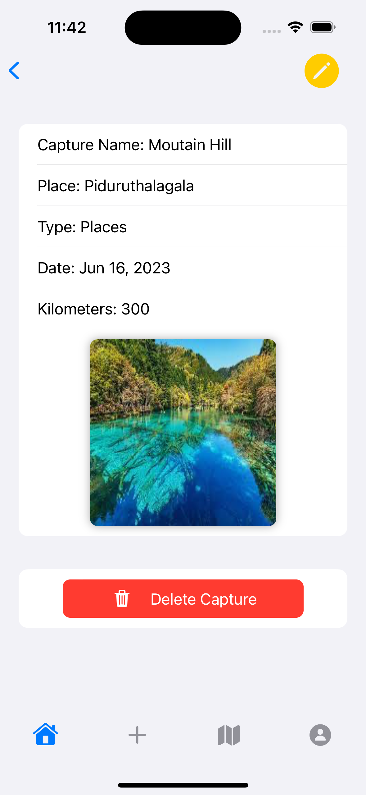
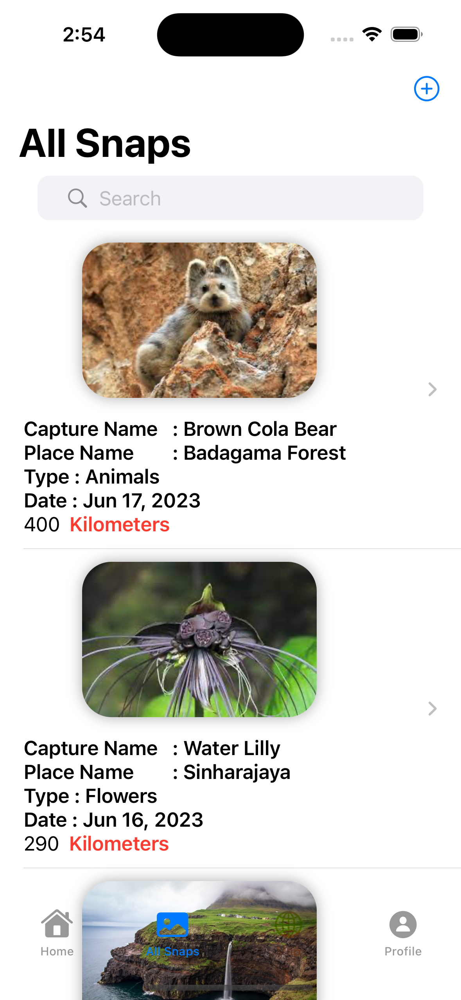

Please go under edit and edit this file as needed for your project.  There is no seperate documentation needed.

# Project Name - Travello
# Student Id - IT20130770
# Student Name - Gunarathna W.R.D

#### 01. Brief Description of Project - Travello is a groundbreaking iOS app designed to empower travel enthusiasts, nature lovers, and photographers by providing them with a unique platform to store, organize, and showcase their awe-inspiring collection of photographs. Whether you're capturing rare plants, exotic flowers, breathtaking landscapes, or captivating wildlife encounters, Travello is your ultimate companion for documenting and reliving your most extraordinary adventures.

With its user-friendly interface and powerful features, Travello makes it effortless to curate your personal gallery of rare finds from around the world. Seamlessly integrated with your iPhone's camera, the app enables you to capture and store high-quality images on the go. Simply snap a photo of that vibrant orchid, elusive leopard, or hidden gem of a location, and Travello will ensure it is securely saved within your collection.

What sets Travello apart is its exceptional organization capabilities. The app intelligently categorizes your photographs, allowing you to easily navigate and search through your archive. Whether you want to quickly find that picture of the majestic Baobab tree or create themed albums dedicated to specific regions or species, Travello's advanced tagging and sorting features have got you covered.

#### 02. Users of the System - The users of the Travello app are travel enthusiasts, nature lovers, photographers, and anyone passionate about documenting and sharing their travel experiences.
1) Travel Photographers
2) Nature Enthusiasts
3) Adventure Seekers
4) Memory Keepers

#### 03. What is unique about your solution - Travello stands out from other travel photography apps with its unique combination of features and functionalities that cater specifically to the needs of users passionate about rare plants, flowers, places, and animals. Unlike generic photo storage apps, Travello is designed specifically for travel enthusiasts who want to capture and organize their photographs of rare and extraordinary elements found in nature. The app recognizes the unique interests of users and provides tailored tools and features to enhance their experience.

Travello goes beyond basic photo storage and offers advanced organization capabilities. The app intelligently categorizes and tags photographs, allowing users to easily navigate and search through their extensive collections. Users can create themed albums, sort photos by location, species, or other criteria, making it effortless to find and showcase specific photographs.

Travello understands that photographs are not just images but powerful storytelling tools. The app provides intuitive storytelling features, allowing users to add descriptions, geotags, and timestamps to their photos, enabling them to create engaging narratives around their travel experiences. This enhances the ability to share stories and memories with others.

#### 04. Differences of Assignment 02 compared to Assignment 01

Assignment 01                                 Assignment 02 
Used Swift UIkit                              Used Swift UI    
Not Used mapkit                               Used Map kit  
Implemented Student Note application          Implemented Travel phoography appliction         

#### 05. Briefly document the functionality of the screens you have (Include screen shots of images)
e.g. The first screen is used to capture a photo and it will be then processed for identifying the landmarks in the photo.

[]
[]
[]
[]
[]
[]
[]
[]
[]
[]
[]

#### 06. Give examples of best practices used when writing code
e.g The code below uses consistant naming conventions for variables, uses structures and constants where ever possible. (Elaborate a bit more on what you did)

1) Used a proper code structure
2) Code reused
3) using arrays and fetch the data

struct AddNatureView: View {
    @Environment(\.managedObjectContext) var managedObjContext
    @Environment(\.dismiss) var dismiss
    
    let types = ["Plants", "Places", "Flowers","Animals"]
    
    @State private var name = ""
    @State private var type = ""
    @State private var place = ""
    @State private var kilometers : Double = 0
    @State private var selectedimage: Data = .init(count: 0)
    @State private var selectedItems: [PhotosPickerItem] = []
    @State private var selectedDate = Date()
    @State private var isActive = false
    
  struct EditNatureView: View {
    @Environment(\.managedObjectContext) var managedObjContext
    @Environment(\.dismiss) var dismiss
    
    var nature: Nature // Existing Food object
    let types = ["Plants", "Places", "Flowers","Animals"]
    
    @State private var name: String
    @State private var place: String
    @State private var type: String
    @State private var kilometers: Double
    @State private var selectedimage: Data
    @State private var selectedItems: [PhotosPickerItem] = []
    @State private var selectedDate = Date()
    
    struct HomeView: View {
    @Environment (\.managedObjectContext) var managedObjContext

    @FetchRequest(sortDescriptors: [SortDescriptor(\.date, order:.reverse)]) var nature: FetchedResults<Nature>

    @State private var deletionIndexSet: IndexSet?
    @State private var currentDate = Date()
    @State private var showingAddView = false
    @State private var showingMapView = false
    @State private var selectedimage: Data = .init(count: 0)
    @State private var showingDeleteAlert = false
    
#### 07. UI Components used
1).Photos Card view
2).Snaps List
3).Tab View
4).Landing Page Component
5).Map View
6).Scroll view (Horizontally and Vertically)

#### 08. Testing carried out

import XCTest
import CoreData
@testable import NatureNut

final class DataControllerTests: XCTestCase {
    var dataController: DataController!
    var context: NSManagedObjectContext!

    override func setUpWithError() throws {
           dataController = DataController()
           context = dataController.container.viewContext
       }

       override func tearDownWithError() throws {
          
           let fetchRequest: NSFetchRequest<NSFetchRequestResult> = NSFetchRequest(entityName: "Nature")
                   let deleteRequest = NSBatchDeleteRequest(fetchRequest: fetchRequest)
                   try context.execute(deleteRequest)
               }

    func testAddNature() throws {
        // Given
        let name = "Nature 1"
        let place = "Park"
        let kilometers: Double = 10.5
        let type = "Plants"

        // When
        dataController.addNature(name: name, place: place, kilometers: kilometers, type: type, context: context)

        // Then
        let fetchRequest: NSFetchRequest<Nature> = NSFetchRequest(entityName: "Nature")
                let results = try context.fetch(fetchRequest)
                XCTAssertEqual(results.count, 1)
                XCTAssertEqual(results.first?.name, name)
                XCTAssertEqual(results.first?.place, place)
                XCTAssertEqual(results.first?.kilometers, kilometers)
                XCTAssertEqual(results.first?.type, type)
            }
    func testEditNature() throws {
        // Given
        let originalName = "Nature 1"
        let newName = "Updated Nature"
        let place = "Park"
        let originalKilometers: Double = 10.5
        let updatedKilometers: Double = 15.0
        let type = "Plants"

        // Add a nature entry to the context
        let nature = Nature(context: context)
        nature.name = originalName
        nature.place = place
        nature.kilometers = originalKilometers
        nature.type = type
        try context.save()

        // When
        dataController.editNature(nature: nature, name: newName, place: place, kilometers: updatedKilometers, type: type, context: context)
        // Then
        let fetchRequest: NSFetchRequest<Nature> = NSFetchRequest(entityName: "Nature")
                let results = try context.fetch(fetchRequest)
                XCTAssertEqual(results.count, 1)
                XCTAssertEqual(results.first?.name, newName)
                XCTAssertEqual(results.first?.place, place)
                XCTAssertEqual(results.first?.kilometers, updatedKilometers)
                XCTAssertEqual(results.first?.type, type)
            }
        }

import XCTest

final class NatureNutUITests: XCTestCase {

    override func setUpWithError() throws {
        // Put setup code here. This method is called before the invocation of each test method in the class.

        // In UI tests it is usually best to stop immediately when a failure occurs.
        continueAfterFailure = false

        // In UI tests it’s important to set the initial state - such as interface orientation - required for your tests before they run. The setUp method is a good place to do this.
    }

    override func tearDownWithError() throws {
        // Put teardown code here. This method is called after the invocation of each test method in the class.
    }

    func testExample() throws {
        // UI tests must launch the application that they test.
        let app = XCUIApplication()
                app.launch()
        
        let collectionViewsQuery = app.collectionViews
        collectionViewsQuery/*@START_MENU_TOKEN@*/.textFields["Enter Capure Name"]/*[[".cells.textFields[\"Enter Capure Name\"]",".textFields[\"Enter Capure Name\"]"],[[[-1,1],[-1,0]]],[0]]@END_MENU_TOKEN@*/.tap()
        
        let enterPlaceNameTextField = collectionViewsQuery/*@START_MENU_TOKEN@*/.textFields["Enter Place Name"]/*[[".cells.textFields[\"Enter Place Name\"]",".textFields[\"Enter Place Name\"]"],[[[-1,1],[-1,0]]],[0]]@END_MENU_TOKEN@*/
        enterPlaceNameTextField.tap()
        enterPlaceNameTextField.tap()
        
        let slider = collectionViewsQuery/*@START_MENU_TOKEN@*/.sliders["0"]/*[[".cells.sliders[\"0\"]",".sliders[\"0\"]"],[[[-1,1],[-1,0]]],[0]]@END_MENU_TOKEN@*/
        slider/*@START_MENU_TOKEN@*/.press(forDuration: 0.8);/*[[".tap()",".press(forDuration: 0.8);"],[[[-1,1],[-1,0]]],[0]]@END_MENU_TOKEN@*/
        slider.tap()
        app/*@START_MENU_TOKEN@*/.collectionViews.containing(.other, identifier:"Vertical scroll bar, 1 page").element/*[[".collectionViews.containing(.other, identifier:\"Horizontal scroll bar, 1 page\").element",".collectionViews.containing(.other, identifier:\"Vertical scroll bar, 1 page\").element"],[[[-1,1],[-1,0]]],[0]]@END_MENU_TOKEN@*/.tap()
        collectionViewsQuery/*@START_MENU_TOKEN@*/.buttons["Save"]/*[[".cells.buttons[\"Save\"]",".buttons[\"Save\"]"],[[[-1,1],[-1,0]]],[0]]@END_MENU_TOKEN@*/.tap()
        
    }

    func testLaunchPerformance() throws {
        if #available(macOS 10.15, iOS 13.0, tvOS 13.0, watchOS 7.0, *) {
            // This measures how long it takes to launch your application.
            measure(metrics: [XCTApplicationLaunchMetric()]) {
                XCUIApplication().launch()
            }
        }
    }
}

#### 09. Documentation 

(a) Design Choices =  When designing the Travello mobile application, there are several design choices that need to be considered to ensure that the app meets the needs of its target audience - students. Some of the design choices that can be made are:

User Interface (UI) Design: The user interface of the Ever-Note mobile application should be designed to be simple, intuitive, and easy to use. The app should be visually appealing with clear and concise text, and easy-to-understand icons.

Color Scheme: The color scheme of the app should be chosen carefully to ensure that it is visually pleasing and easy on the eyes. Bright, bold colors can be used to draw attention to important information, while softer colors can be used for background elements.

Font Selection: The font used in the app should be legible and easy to read, even in small sizes. Sans-serif fonts are a good choice for digital interfaces because they are easy to read on screens of all sizes.

Navigation: The navigation within the app should be designed to be intuitive and easy to use. The main categories should be clearly labeled and easily accessible from anywhere in the app.

Responsiveness: The app should be responsive and work smoothly on different devices and screen sizes. It should be tested on various devices and platforms to ensure compatibility.

(b) Implementation Decisions = Using Xcode and Swift: The project will be developed using Xcode and Swift, as they are powerful and widely used tools for iOS development. User interface design: The user interface will be designed using UIKit, which provides a set of pre-built user interface elements that can be used to build intuitive and visually appealing interfaces. Database management: To manage the student notes data, a database will be implemented using CoreData. This will allow the application to store, retrieve, and manage the student notes data in a structured and efficient manner. Segmented control: To implement the two main categories of notes (completed studied lessons,to be continoue lessons), a segmented control will be used. This control will allow the user to select the desired lesson catergory, which will then filter the lesson list accordingly. Slider control: A slider control will be used to enable the user to select the time of they had studied that lesson. Search bar: A search bar will be implemented to enable the user to search for specific lesson in the lesson list. This will provide a convenient way for users to find the lessons they need quickly and easily. CRUD operations: The application will support CRUD (Create, Read, Update, Delete) operations for managing the student notes data. This will allow the user to add, view, edit, and delete lessons from the lesson list as needed.

(c) Challenges = Developing a mobile app like "Travello" presents developers with various challenges that need to be addressed effectively. These challenges encompass different aspects of the development process and require careful management and problem-solving. Here are some key obstacles that developers may encounter and how they can overcome them:

1. Familiarity with Development Tools: Developing a mobile app often requires familiarity with programming tools such as Xcode, Swift, and UIKit. If developers lack experience or knowledge in these tools, they may need to invest additional time in learning and mastering them. Resources like manuals, tutorials, online courses, and seeking advice from experienced programmers can greatly aid in overcoming this obstacle.

2. User Interface Design: The success of a mobile app heavily relies on its user interface (UI) design. Building a user-friendly and intuitive UI that meets user expectations demands strong design skills and an understanding of UI best practices. Developers can stay updated with current UI trends, conduct usability testing with real users, and iterate on the design to ensure its effectiveness.

3. Issue Fixing and Debugging: The software development process often involves the challenging task of identifying and fixing bugs to ensure the app operates correctly. Developers may need to invest extra time in thoroughly analyzing their code, using debugging tools, and conducting systematic testing to identify and resolve issues effectively.

4. Time Management: Developing a mobile app requires effective time management, especially when dealing with other commitments. Developers need to establish a project plan with realistic deadlines, prioritize tasks, and allocate downtime to prevent burnout. By managing their time wisely and staying focused, developers can ensure they dedicate sufficient time to the development process without neglecting other responsibilities.

5. Continuous Learning: The field of mobile app development is ever-evolving, with new technologies, frameworks, and best practices emerging regularly. Developers should embrace a mindset of continuous learning and improvement, staying updated with the latest advancements in the industry. Engaging in professional development activities, attending conferences, participating in developer communities, and exploring relevant resources can help developers overcome obstacles and stay at the forefront of their craft.

By addressing these challenges through dedicated learning, effective time management, careful UI design, thorough debugging, and staying updated with industry trends, developers can navigate the complexities of developing a mobile app like "Travello" successfully. With determination and perseverance, these obstacles can be overcome, leading to a high-quality app that meets the needs of its users.

#### 10. Additional iOS Library used

MapKit: The MapKit framework is used to integrate map functionality into the app, specifically for displaying the locations on the map view. MapKit provides classes and APIs to handle map-related operations, such as displaying annotations, setting map region, and handling user interactions with the map.

#### 11. Reflection of using SwiftUI compared to UIKit

SwiftUI: A Revolutionary, Streamlined Approach to UI Development
SwiftUI is a revolutionary framework for building user interfaces in iOS apps. With its modern and declarative programming paradigm, SwiftUI simplifies UI development by allowing developers to describe the desired UI state rather than specifying each step to create and update the UI. This declarative approach eliminates the need for manual UI updates, resulting in cleaner and more maintainable code.

One of the key benefits of SwiftUI is its code reusability. Developers can easily compose UI elements and create reusable components, saving time and effort in building consistent interfaces across multiple screens and devices. SwiftUI's robust set of built-in views and modifiers further accelerates development by providing a comprehensive library of UI elements that can be customized to fit specific design requirements.Another significant advantage of SwiftUI is its real-time preview feature. Developers can see the changes to the UI in real-time as they write code, thanks to SwiftUI's live previews. This instant feedback greatly enhances the development workflow, allowing developers to iterate quickly, experiment with different designs, and ensure pixel-perfect UI layouts.

UIKit: The Traditional Foundation of iOS UI Development

UIKit, the long-standing UI framework in iOS development, follows an imperative and procedural programming style. Developers using UIKit have full control over every step of the UI creation and update process. They need to manually handle UI updates, responding to events and data changes by explicitly modifying the UI elements.UIKit provides extensive flexibility and control, making it a powerful tool for crafting highly customized and intricate user interfaces. It offers a wide range of UI components and advanced features, enabling developers to create visually rich and interactive app experiences.While SwiftUI introduces a modern approach to UI development, UIKit remains a solid and widely-used framework that powers countless iOS applications. Many existing apps are built with UIKit, and it continues to receive updates and support from Apple.

Choosing between SwiftUI and UIKit depends on factors such as project requirements, development timeline, and familiarity with the frameworks. SwiftUI offers a more streamlined and efficient development experience, while UIKit provides deep customization capabilities. Developers can leverage the strengths of each framework based on their specific needs and preferences.

#### 12. Reflection General
 Less Knowledge about Swift UI. So that implementation was bit difficult and most of were done going through the self study

  

